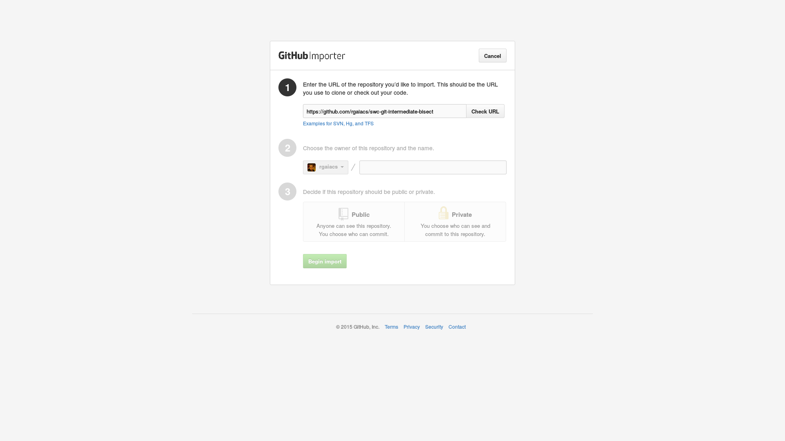
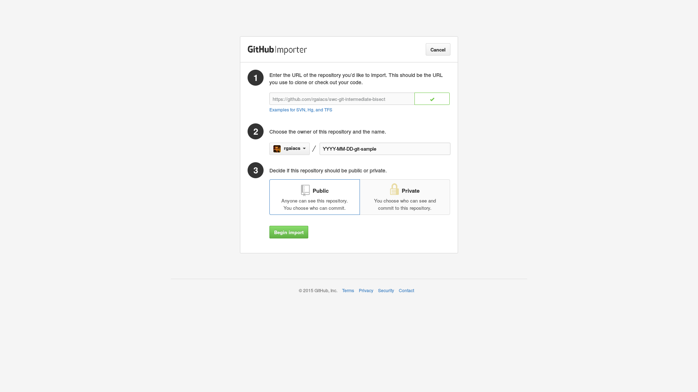
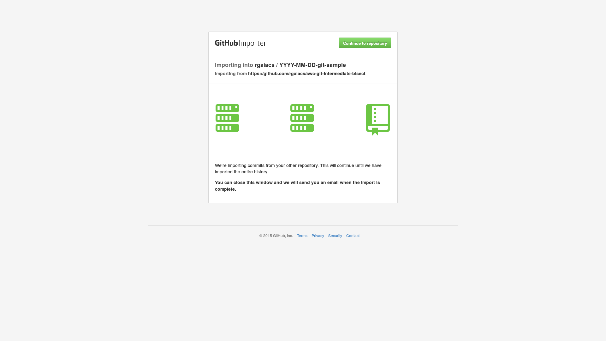
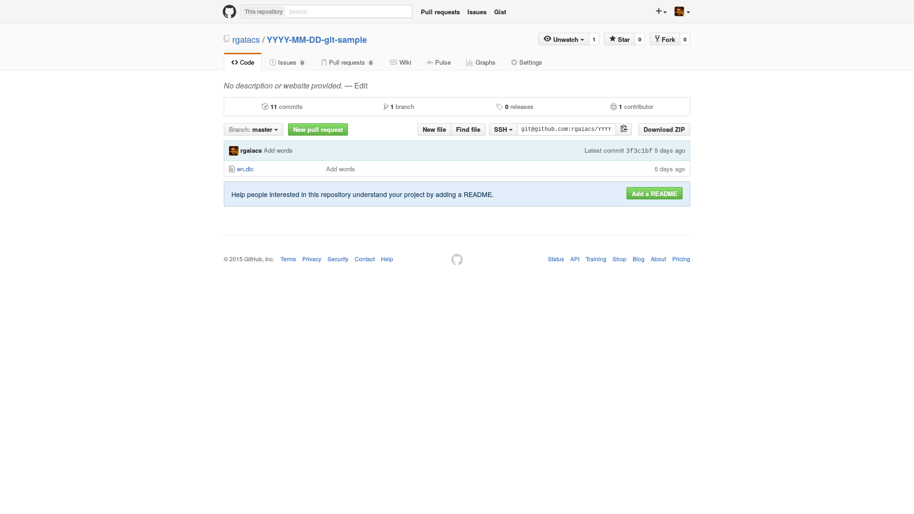

We are going to use [this Git repository](https://github.com/rgaiacs/swc-git-intermediate-bisect)
in many parts of this lesson.
Before we start the real lesson lets copy that repository
so everyone has a copy to work on.

To copy that repository we are going to use [GitHub Importer](https://import.github.com/).
Open [https://import.github.com/new?import_url=https://github.com/rgaiacs/swc-git-intermediate-bisect](https://import.github.com/new?import_url=https://github.com/rgaiacs/swc-git-intermediate-bisect).

We can now click on "Check URL".

After GitHub verify the repository,
we can select the owner of the new copy of the repository
and give it a name, for example `YYYY-MM-DD-git-sample`.

And we can click on "Begin import".

When GitHub finished copying the repository
we can click on "Continue to repository".

To finish,
we clone that repository to our local machine.

~~~ {.bash}
$ git clone https://github.com/rgaiacs/YYYY-MM-DD-git-sample
~~~
~~~ {.out}
Cloning into 'YYYY-MM-DD-git-sample'...
remote: Counting objects: 33, done.
remote: Compressing objects: 100% (14/14), done.
remote: Total 33 (delta 8), reused 33 (delta 8), pack-reused 0
Unpacking objects: 100% (33/33), done.
Checking connectivity... done.
~~~

> ## SSH {.callout}
>
> If we have SSH public key configure on our machine we can use
>
> ~~~ {.bash}
> $ git clone git@github.com:rgaiacs/YYYY-MM-DD-git-sample
> ~~~
> ~~~ {.out}
> Cloning into 'YYYY-MM-DD-git-sample'...
> remote: Counting objects: 33, done.
> remote: Compressing objects: 100% (14/14), done.
> remote: Total 33 (delta 8), reused 33 (delta 8), pack-reused 0
> Unpacking objects: 100% (33/33), done.
> Checking connectivity... done.
> ~~~

And we change the current directory to the Git repository that we just cloned:

~~~ {.bash}
$ cd YYYY-MM-DD-git-sample
~~~
